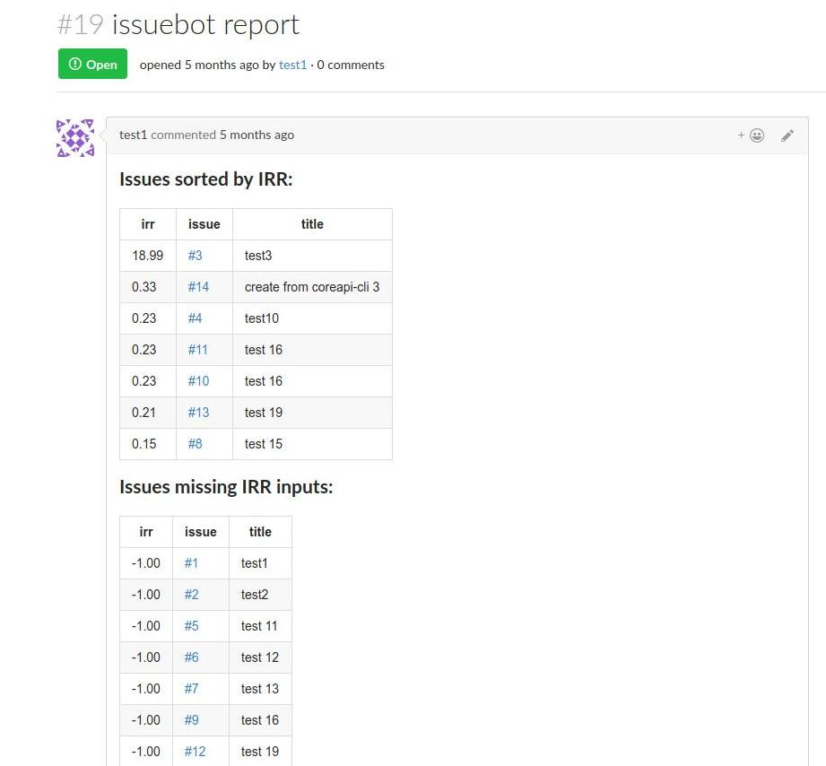

# gitea-issuebot
Do extra processing of gitea issues -- current version does [internal rate of return (IRR)](https://www.google.com/search?q=internal+rate+of+return+project+management) math and stores the results in a persistent issue that the script itself creates and manages.  See https://github.com/go-gitea/gitea/issues/2616 for some discussion.

Right now the persistent issue where the report gets stored/updated looks something like this (this is from our gitea test instance, so not very realistic, but should give you the basic idea):

